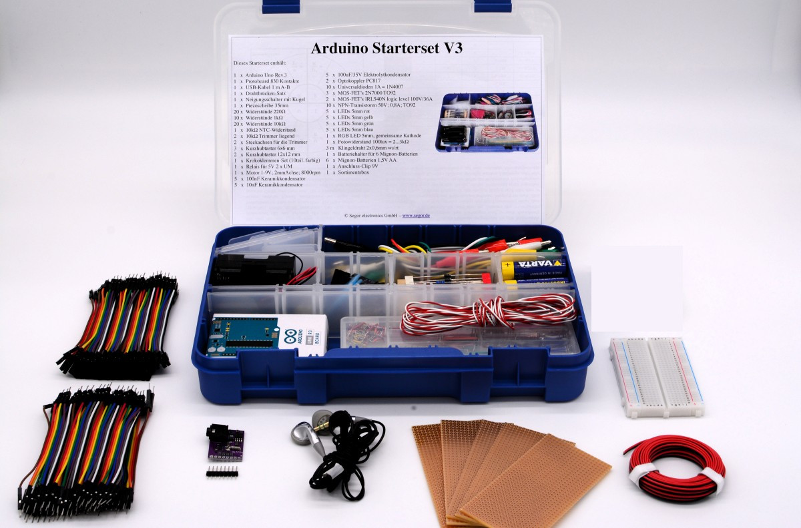

# #ASKmod Content

| Version: | 1.0.0        |
| -------- | ------------ |
| License: | [CC-BY-SA 4.0](LICENSE.md) |

## Arduino Set

## Items

- [Arduino Starter Set V3](https://askotec.openculture.agency/product/arduino-starter-set-v3/)
- [Bread Board 400](https://askotec.openculture.agency/product/bread-board/)
- [Twin Wire for Arduino Set](https://askotec.openculture.agency/product/twin-wires/)
- [Radio Module](https://askotec.openculture.agency/product/radio-set/)
- [Headphones](https://askotec.openculture.agency/product/headphones/)
- [Jumper Wire F/M (PACK OF 40)](https://askotec.openculture.agency/product/jumper-wire-f-m-pack-of-40/)
- [Jumper Wire M/M (PACK OF 40)](https://askotec.openculture.agency/product/jumper-wire-m-m-pack-of-40/)
- [Circuit Board for Arduino Set](https://askotec.openculture.agency/product/circuit-board/)

## Reference

GitHub Repository: https://github.com/opencultureagency/ASKmod-Arduino-Set